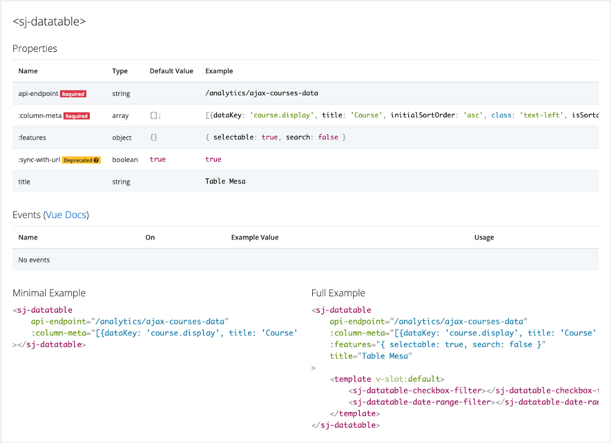

# Vue Documenter
An automatic, living Vue component documenter - yes - a component that documents components, with no build step (ie Webpack or Rollup or extra commands to run, because it's just another component).

# Usage
```vue
// YourVueDocumentationPage.vue

<template>
	<div>
		// Initially works with Bootstrap 4 classes
		<vue-documenter>
			<some-component></some-component>
			<another-component></another-component>
		</vue-documenter>

		// But you can also remap your own (these are defaults)
		/*
		<vue-documenter
			:css-override-classes="{
				badgeDeprecated: 'badge badge-warning',
				badgeOptional: 'badge badge-secondary',
				badgeRequired: 'badge badge-danger',
				card: 'card card-body',
				componentsColumn: 'col-sm-9',
				componentsColumnComponent: 'card card-body',
				componentsColumnComponentTableWrapper: 'table-responsive',
				componentsColumnComponentTable: 'table table-striped',
				container: 'container-fluid',
				exampleMinimal: 'col-sm-6',
				exampleFull: 'col-sm-6',
				instructions: 'alert alert-info',
				tableOfContentsColumn: 'col-sm-3',
				tableOfContentsColumnList: '',
				row: 'row'
			}"
		>
			<some-component></some-component>
			<another-component></another-component>
		</vue-documenter>
		*/
	</div>
</template>
<script>

	import VueDocumenter from 'vue-documenter';

	import SomeComponent from './components/SomeComponent.vue';
	import AnotherComponent from './components/AnotherComponent.vue';

	export default {
		components: {
			VueDocumenter,
			SomeComponent,
			AnotherComponent,
		},
		data () {
			return {}
		}
	}
</script>

```

# Output


# Why?
For when you don't always have time to keep secondary documentation updated, or aren't able to roll out something like Storybook for everybody on your team.

# Read more
https://medium.com/skilljar-engineering/the-quickest-dirtiest-automatic-est-vue-documenter-ever-cf55845b4df9

# Roadmap
* Add ability to group components in the documentation
* Update events' example value to be code highlighted
* Update documentation table of contents to be sticky
* Update CSS override classes to be individual properties rather than one all-or-nothing overridable object
* Add description field for prop meta
* Better usage of slots
